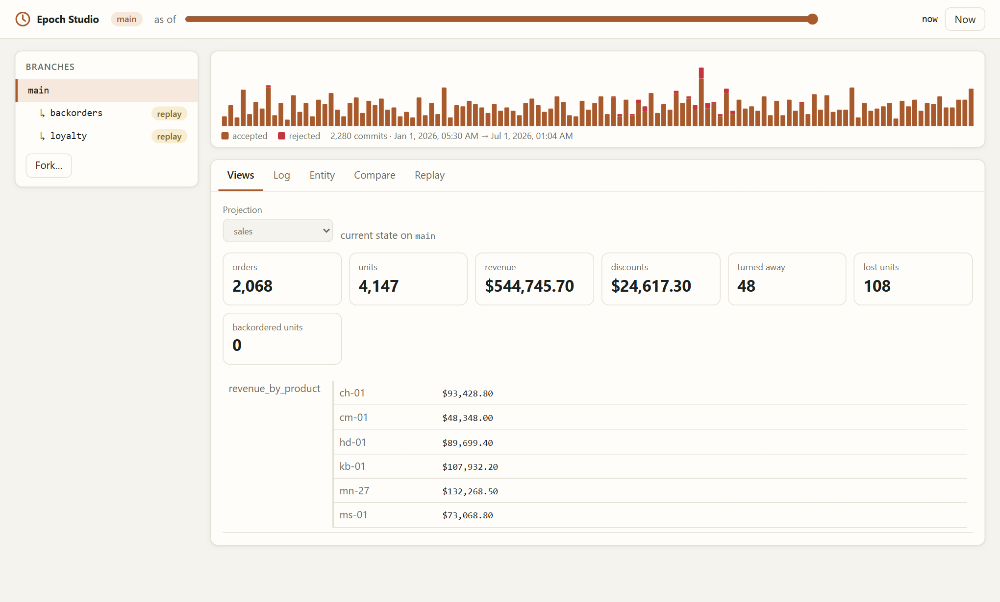
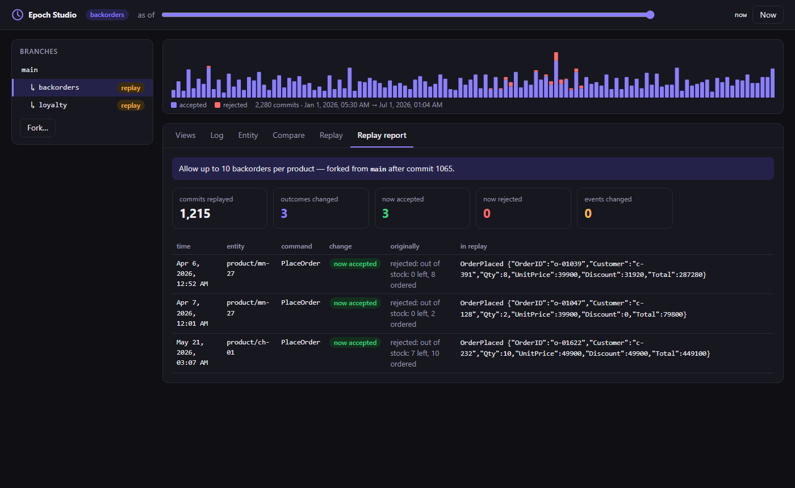
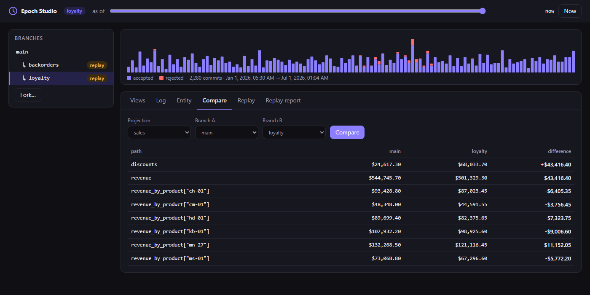

# Epoch

**Backtest your business rules against real history.**

Epoch is a Go library that records every command your application receives, including the ones it rejects, alongside the events it produces. That record lets you:

- **Time travel.** See any entity, or any report, exactly as it was at any moment.
- **Branch history.** Fork the past into an isolated, copy-on-write branch and change it.
- **Replay with new rules.** Re-run months of real commands through a changed pricing, credit, fraud or stock rule, and get a precise list of every decision that would have come out differently.
- **Compare.** Diff any read model between what happened and what would have happened.

```text
$ go run ./examples/shop

3. What if customers of 12+ months had had 15% off all year?
   Replayed 2,280 commands on branch "loyalty" in 13ms.
   1,477 orders turned out differently: 0 now accepted, 0 now rejected, 1,477 re-priced.

                                actual        loyalty     difference
   orders                        2,068          2,068              ·
   discounts given          $24,617.30     $68,033.70    +$43,416.40
   revenue                 $544,745.70    $501,329.30    -$43,416.40
```



The core library has **zero dependencies** and needs Go 1.22 or newer. Storage is pluggable: an in-memory store and a pure-Go SQLite store (no cgo) are included, and a conformance suite lets you add your own.

## Why

When a team changes a business rule (a discount, a credit limit, a fraud threshold, a stock policy), the impact is usually estimated with a spreadsheet and a guess. The data needed to *know* is gone. Your database stores outcomes, and a rejected order leaves no trace at all.

Epoch keeps the inputs. Because each decision is a pure function of state and command, Epoch can re-make every past decision with the new rule, in order, with the state each decision would actually have seen. Accepting one extra order early in the month correctly changes the stock that every later order sees.

## Install

```sh
go get github.com/HarshalPatel1972/epoch/v2
go get github.com/HarshalPatel1972/epoch/v2/sqlitestore   # optional: durable storage
```

## A minimal example

A model is your business logic as two pure functions: `Decide` turns a command into events or rejects it, and `Evolve` folds events into state.

```go
type Account struct{ Balance, Limit int64 }

type (
	Open     struct{ Limit int64 }   // commands: what you were asked to do
	Deposit  struct{ Amount int64 }
	Withdraw struct{ Amount int64 }

	Opened    struct{ Limit int64 }  // events: what happened
	Deposited struct{ Amount int64 }
	Withdrew  struct{ Amount int64 }
)

var Accounts = &epoch.Model[Account]{
	Name:     "account",
	Commands: []any{Open{}, Deposit{}, Withdraw{}},
	Events:   []any{Opened{}, Deposited{}, Withdrew{}},
	Evolve: func(a Account, e any) Account {
		switch e := e.(type) {
		case Opened:
			a.Limit = e.Limit
		case Deposited:
			a.Balance += e.Amount
		case Withdrew:
			a.Balance -= e.Amount
		}
		return a
	},
	Decide: func(a Account, c any, now time.Time) ([]any, error) {
		switch c := c.(type) {
		case Open:
			return []any{Opened(c)}, nil
		case Deposit:
			return []any{Deposited(c)}, nil
		case Withdraw:
			if a.Balance-c.Amount < -a.Limit {
				return nil, ErrInsufficientFunds
			}
			return []any{Withdrew(c)}, nil
		}
		return nil, fmt.Errorf("unknown command %T", c)
	},
}
```

Use it like any other domain service:

```go
store, _ := sqlitestore.Open("bank.db")

res, err := Accounts.Handle(ctx, store, "alice", Withdraw{Amount: 500})
if errors.Is(err, epoch.ErrRejected) {
	// The rejection is recorded too. A replay can find out whether new rules
	// would have accepted it.
}

now, _ := Accounts.Load(ctx, store, "alice")
then, _ := Accounts.Load(ctx, store, "alice", epoch.AsOf(lastFriday))
```

Then ask what a different rule would have done:

```go
stricter := *Accounts
stricter.Decide = decideWithLowerOverdraft

report, _ := epoch.Replay(ctx, store, epoch.ReplayOptions{
	Name:   "overdraft-20",
	From:   startOfQuarter,
	Models: []epoch.AnyModel{&stricter},
})
fmt.Println(report.NowRejected, "withdrawals would have been declined")
fmt.Println(report.NowAccepted, "withdrawals that were declined would have gone through")

cmp, _ := epoch.Compare(ctx, store, LedgerView, epoch.Main, "overdraft-20")
for _, c := range cmp.Changes {
	fmt.Println(c.Path, c.From, "→", c.To)
}
```

Each of these is a runnable example in the [package documentation](https://pkg.go.dev/github.com/HarshalPatel1972/epoch/v2).

## Try the demo

```sh
git clone https://github.com/HarshalPatel1972/epoch
cd epoch/v2
go run ./examples/shop              # the tour, in your terminal
go run ./examples/shop -serve :8080 # then explore it in Epoch Studio
```

The demo generates six months of history for a small shop, then answers three questions:

1. What was in stock on 1 March?
2. What if we had allowed backorders when stock ran out? (Fewer orders are recovered than you might expect, because backorders eat into later stock. Replay accounts for that.)
3. What would a 15% loyalty discount have cost?

## Concepts

| | |
|---|---|
| **Model** | One kind of entity: `Decide` (command → events or error) and `Evolve` (state + event → state). Must be deterministic. |
| **Commit** | One entry in the log: the command, the events it produced or the rejection reason, a time, and a global sequence number. |
| **Branch** | A line of history. `main` always exists; `Fork` creates a copy-on-write branch at any point in its parent's history. Branches nest. |
| **Replay** | Forks a branch at a point in the past and re-decides every later command with the Models you pass. Other commits are copied as recorded. Returns a `Report` of every changed outcome. |
| **Projection** | A read model folded from the whole log: a report, a dashboard, a balance sheet. It can be computed on any branch, at any time. |
| **Fact** | Events that are not decisions, such as a payment confirmed by a provider. Record them with `Model.Record`; replays copy them unchanged. |

### Options

Reads and writes take options: `epoch.On(branch)`, `epoch.AsOf(t)`, `epoch.AtSeq(n)`, `epoch.WithTime(t)` (backdating, for imports and tests) and `epoch.CommandID(id)` (idempotency: a repeated ID returns the original outcome instead of executing twice).

## Epoch Studio

`epochhttp` serves a web UI and JSON API for exploring history: an activity chart with a time slider, the branch tree, the log, an entity inspector, branch comparison, and a replay runner. Every view is a shareable link.

```go
mux.Handle("/epoch/", http.StripPrefix("/epoch", epochhttp.New(epochhttp.Config{
	Store:       store,
	Models:      []epoch.AnyModel{Accounts},
	Projections: []epoch.AnyProjection{LedgerView},
	Policies:    map[string]epoch.AnyModel{"overdraft 20": &stricter},
	AllowWrites: true, // allow forks and replays from the UI
})))
```

Studio has no authentication of its own and shows your full history. Mount it behind your existing auth or on an internal address. It is read-only unless `AllowWrites` is set, and its write endpoints only accept requests a browser cannot forge from another site.

| | |
|---|---|
|  |  |

## Storage

| Package | Use it for |
|---|---|
| `memstore` | Tests, examples, short-lived processes. |
| `sqlitestore` | Single-node applications. Pure Go (`modernc.org/sqlite`), WAL mode, needs Go 1.25+. Separate module, so the core stays dependency-free. |

A store implements a small interface: append with an optimistic version check, read a branch's commits, and save branches and snapshots. Branch inheritance is resolved by Epoch, so stores never deal with it. To write a store for Postgres, DynamoDB or anything else, run the conformance suite against it:

```go
func TestConformance(t *testing.T) {
	epochtest.Run(t, func(t *testing.T) epoch.Store { return mystore.New(t) })
}
```

## How Epoch compares

Epoch is not a database, and does not try to replace one. It overlaps with several tools:

| | Time travel | Branches | Re-run history with **new logic** |
|---|---|---|---|
| SQL temporal tables, XTDB, Datomic `as-of` | ✓ | – | – |
| Dolt, Neon, PlanetScale branching | ✓ | ✓ | – (branches hold data, not decisions) |
| Datomic `d/with` | ✓ | speculative | – |
| EventStoreDB, Marten, Axon | ✓ | – | rebuild projections, not decisions |
| **Epoch** | ✓ | ✓ | ✓ |

Event-sourcing frameworks can rebuild a *read model* from stored events. Epoch also re-makes the *decisions*, because it stores the commands that caused them, including rejected ones.

## Guarantees and limits

- **Determinism is your side of the contract.** Replays are only meaningful if `Decide` depends on nothing but state, command and the `now` it is given. Put external data (prices, scores, exchange rates) in the command so it is recorded.
- **Replays re-run inputs, not behaviour.** A replay tells you what your system would have done with the requests it actually received. It cannot tell you how customers would have reacted to different rules.
- **Concurrency.** Writes to one entity use optimistic concurrency; `Handle` retries conflicts automatically. Different entities never block each other.
- **Time never goes backwards on a branch.** A commit's time is the later of the requested time and the branch's previous commit, so `AsOf` reads are exact.
- **Snapshots** keep loads fast: every 100 events by default (`Model.SnapshotEvery`). Without them, each command re-reads the entity's full history. Change `Model.Schema` when your state shape or `Evolve` changes, and old snapshots are ignored.
- **Projections** fold the whole visible log on every `Get`. That is fast for tens of thousands of commits (see below). For larger histories, cache results or maintain your own read models.
- **Panics in `Decide`** are returned as errors and never recorded as business outcomes. A replay that hits one stops and removes its partial branch.

## Performance

Measured on a laptop (Intel Core i3-1220P, 16 GB, Windows 11, Go 1.26) with `go test -bench . ./memstore ./sqlitestore`:

| Operation | memstore | sqlitestore |
|---|---|---|
| `Handle` a command (entity with a long history) | 42 µs | 0.46 ms |
| `Handle` across 1,000 entities | 63 µs | 0.34 ms |
| `Load` an entity with 10,000 events, snapshots on | 2.4 µs | 82 µs |
| `Load` an entity with 10,000 events, snapshots off | 15 ms | 98 ms |
| `Replay` 10,000 commands with new rules | 35 ms (285k/s) | 0.59 s (17k/s) |
| `Projection.Get` over 10,000 commits | 21 ms | 86 ms |

SQLite writes use one serialised writer, which suits a single application node. Replays batch their writes into one transaction per 500 commits.

## Project status

Epoch v2 is new. The API is stable in shape, but may change before `v2.0.0` based on feedback. Pin a version, and please [open an issue](https://github.com/HarshalPatel1972/epoch/issues) with anything that gets in your way.

Epoch v2 lives in [`v2/`](v2). Epoch v1, an earlier demo HTTP server, has been retired; its code is preserved at the `v1-final` tag.

## Contributing

Bug reports, store implementations and examples are very welcome. See [CONTRIBUTING.md](CONTRIBUTING.md).

## License

[MIT](LICENSE)
